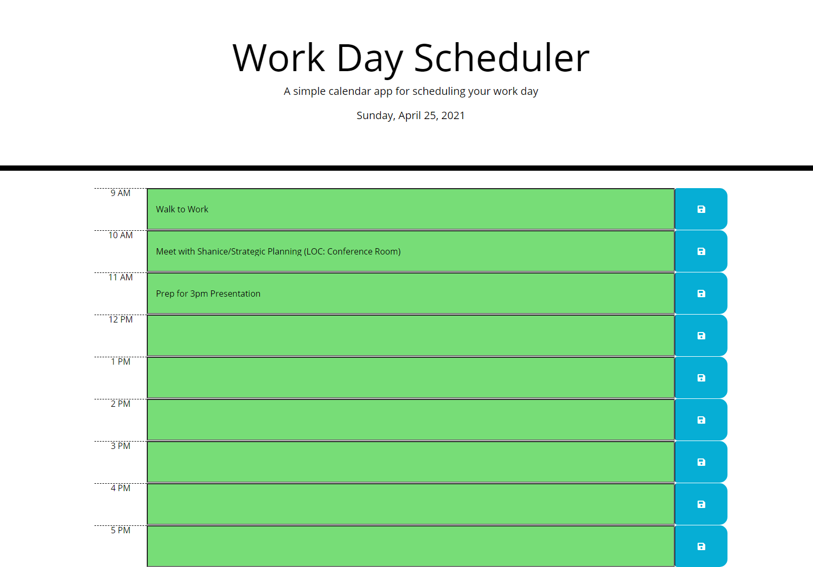

# 05 Third-Party APIs: Work Day Scheduler

## Description
Refactor a simple calendar application that allows a user to save events for each business hour of the day.

### Motivation
Many, if not most, applications contain some aspect that deals with time. Diving in to Moment.js as one data/time handling option was useful for discovering how time data can be passed, formatted, and utlized to update the DOM.

### Learning Targets
This exercise furthered experience dynamically updating HTML and CSS using jQuery and introduced the Moment.js library to handle date and time.

## Core Objectives Met

1. The current day is displayed at the top of the calendar when the planner is opened.
2. When scrolling down, the user is presented with timeblocks for standard business hours.
3. IN PROGRESS: Each timeblock is color-coded to indicate whether it is in the past, present, or future.
4. When a user clicks a timeblock, they can enter an event.
5. When a user clicks a save button for a timeblock, text for that event is saved in local storage.
6. When a user refreshes a page, the saved event persists. 

## Screen Shot

## Deployed Application

https://cailinbellwold.github.io/Work-Day-Scheduler
#

