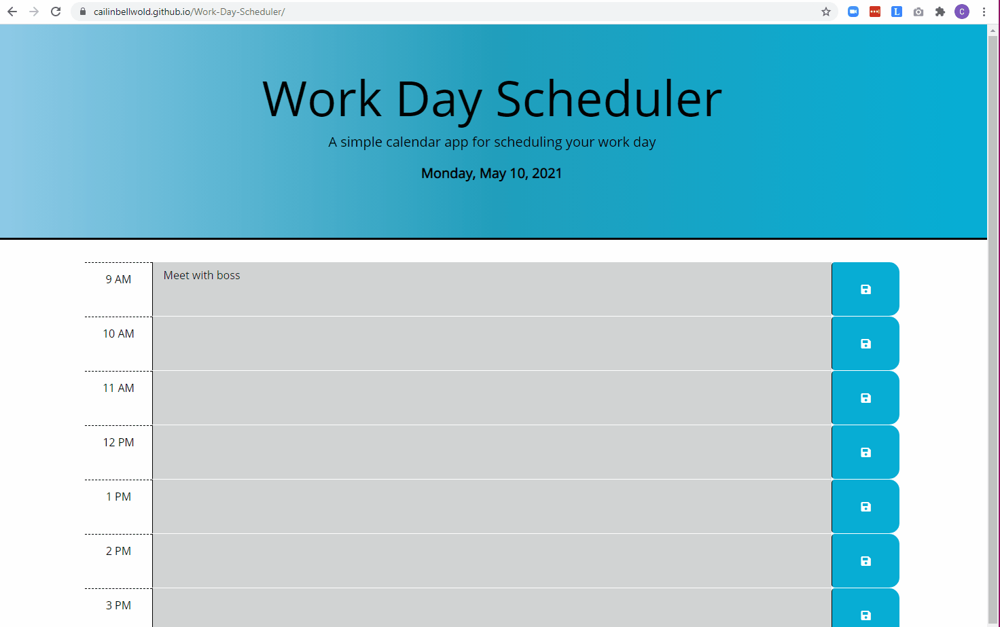

# 05 Third-Party APIs: Work Day Scheduler

## Description 
Refactor a simple calendar application that allows a user to save events for each hour of the business day.

### Motivation
Many, if not most, applications contain some aspect that deals with time. Diving in to Moment.js as one data/time handling option was useful for discovering how time data can be passed, formatted, and utlized to update the DOM.

### Learning Targets
This exercise furthered experience dynamically updating HTML and CSS using jQuery and introduced the Moment.js library to handle date and time.

#
## Core Objectives Met

1. The current day is displayed at the top of the calendar when the planner is opened.
2. When scrolling down, the user is presented with timeblocks for standard business hours.
3. Each timeblock is color-coded to indicate whether it is in the past, present, or future.
4. When a user clicks a timeblock, they can enter an event.
5. When a user clicks a save button for a timeblock, text for that event is saved in local storage.
6. When a user refreshes a page, the saved event persists. 

#
## Technologies Used

HTML, JS, CSS, jQuery, Moment, Google Fonts, Font Awesome, and Bootstrap 

#
## Usage

Demo 1  *Entering an event, clicking save, and refreshing to demonstrate that saved events persist.*

Demo 2: *Resizing responsiveness*

#
## Deployed Application

https://cailinbellwold.github.io/Work-Day-Scheduler
#
## MIT License

&copy;2021 Cailin Bell Wold

Permission is hereby granted, free of charge, to any person obtaining a copy
of this software and associated documentation files (the "Software"), to deal
in the Software without restriction, including without limitation the rights
to use, copy, modify, merge, publish, distribute, sublicense, and/or sell
copies of the Software, and to permit persons to whom the Software is
furnished to do so, subject to the following conditions:

The above copyright notice and this permission notice shall be included in all
copies or substantial portions of the Software.

THE SOFTWARE IS PROVIDED "AS IS", WITHOUT WARRANTY OF ANY KIND, EXPRESS OR
IMPLIED, INCLUDING BUT NOT LIMITED TO THE WARRANTIES OF MERCHANTABILITY,
FITNESS FOR A PARTICULAR PURPOSE AND NONINFRINGEMENT. IN NO EVENT SHALL THE
AUTHORS OR COPYRIGHT HOLDERS BE LIABLE FOR ANY CLAIM, DAMAGES OR OTHER
LIABILITY, WHETHER IN AN ACTION OF CONTRACT, TORT OR OTHERWISE, ARISING FROM,
OUT OF OR IN CONNECTION WITH THE SOFTWARE OR THE USE OR OTHER DEALINGS IN THE
SOFTWARE.
#
